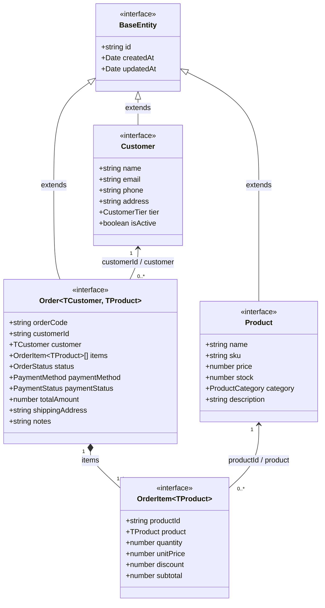

# 📦 Module Quản Lý Đơn Hàng (Order Management) - TypeScript Architecture

- **Học phần:** Lập trình Web Nâng Cao (LTWNC)
- **Đơn vị:** Học viện Công nghệ Bưu chính Viễn thông (PTIT)
- **Tài liệu đề bài gốc:** [docs/de-bai/Tuan-01-TypeScript.md](../../docs/de-bai/Tuan-01-TypeScript.md)
- **File mã nguồn type:** [`order-management.types.ts`](./order-management.types.ts)
- **File kịch bản kiểm thử runtime:** [`order-management.demo.ts`](./order-management.demo.ts)

---

## 1. Sơ Đồ Kiến Trúc & Quan Hệ Dữ Liệu

Module bao gồm 4 thực thể miền (Domain Entities) được chuẩn hoá quan hệ:
- **`Customer`** (1) ──< (N) **`Order`**: Một khách hàng có nhiều đơn hàng.
- **`Order`** (1) ──* (N) **`OrderItem`**: Một đơn hàng bao gồm nhiều dòng sản phẩm.
- **`Product`** (1) ──< (N) **`OrderItem`**: Mỗi dòng đơn hàng tham chiếu đến một sản phẩm cụ thể.



---

## 2. Phân Tích & Cơ Sở Thiết Kế (Design Rationale)

### 2.1. Chuẩn Hoá Enum Dạng Chuỗi (String Enums)
- `OrderStatus`: `PENDING`, `CONFIRMED`, `PROCESSING`, `SHIPPED`, `DELIVERED`, `CANCELLED`, `RETURNED`
- `PaymentMethod`: `COD`, `BANK_TRANSFER`, `CREDIT_CARD`, `E_WALLET`
- `PaymentStatus`: `UNPAID`, `PAID`, `REFUNDED`, `FAILED`
- `CustomerTier`: `STANDARD`, `SILVER`, `GOLD`, `DIAMOND`
- `ProductCategory`: `ELECTRONICS`, `FASHION`, `HOME_APPLIANCES`, `BOOKS`, `FOOD`, `OTHER`

**Cơ sở kỹ thuật:**
- String Enum giúp việc serialization qua giao thức HTTP (REST API / JSON payload) và lưu trữ trong cơ sở dữ liệu (PostgreSQL / MongoDB) luôn giữ được ý nghĩa nghiệp vụ minh bạch.
- Tránh rủi ro sai lệch dữ liệu của Numeric Enum khi thứ tự phần tử bị thay đổi trong quá trình bảo trì mã nguồn.

### 2.2. Kế Thừa BaseEntity & Ràng Buộc Generic
```typescript
export interface Identifiable { readonly id: string; }
export interface Timestampable { readonly createdAt: Date; readonly updatedAt: Date; }
export interface BaseEntity extends Identifiable, Timestampable {}
```
**Cơ sở kỹ thuật:**
- Tuân thủ nguyên lý DRY: Tập trung hoá các trường audit bắt buộc của toàn bộ hệ thống.
- Sử dụng `readonly` ở cấp độ compile-time để ngăn chặn các tác vụ mutate vô ý lên khoá chính và mốc thời gian tạo.
- `Identifiable` đóng vai trò là Generic Constraint (`T extends Identifiable`) cho các tầng Repository/Data-Access dùng chung.

### 2.3. Thiết Kế Generic Trong `OrderItem` và `Order`
- `OrderItem<TProduct = Product>`: Cho phép item linh hoạt giữa trạng thái thô (chỉ có `productId`, `product` là `undefined`) và trạng thái đã nạp (populated `Product` object). Đồng thời, `unitPrice` được lưu độc lập tại thời điểm tạo đơn để bảo toàn lịch sử giá khi giá niêm yết của `Product` thay đổi trong tương lai.
- `Order<TCustomer = Customer, TProduct = Product>`: Cho phép tái sử dụng một cấu trúc duy nhất xuyên suốt các tầng kiến trúc (Database query thô, Service orchestration, và View presentation) mà không cần nhân bản các interface trung gian.

### 2.4. Khai Thác Utility Types Chuẩn Hoá DTO
1. **`Omit<T, K>`**:
   - `CreateProductDto`: Loại bỏ metadata tự sinh (`id`, `createdAt`, `updatedAt`) khỏi payload người dùng gửi lên.
   - `CreateOrderDto`: Loại bỏ các trường hệ thống tính toán (`orderCode`, `totalAmount`, `paymentStatus`,...).
2. **`Pick<T, K>`**:
   - `ProductSummaryDto` & `CustomerSummaryDto`: Chỉ trích xuất các trường cần thiết cho view hiển thị, ngăn chặn over-fetching và tối ưu băng thông mạng.
   - `CreateOrderItemDto`: Payload tạo item từ client chỉ yêu cầu `productId` và `quantity`.
3. **`Partial<T>`**:
   - `UpdateProductDto`, `UpdateCustomerDto`: Chuẩn hoá cho API PATCH, cho phép client cập nhật từng phần dữ liệu một cách an toàn.
   - `UpdateOrderStatusDto`: Kết hợp `Pick<Order, 'status'>` với `Partial<Pick<Order, 'notes'>>`.
4. **`Readonly<T>`**:
   - `ImmutableOrder`: Đóng băng toàn bộ cấu trúc đơn hàng sau khi chuyển trạng thái `DELIVERED`, bảo đảm toàn vẹn dữ liệu kế toán.
5. **`Record<K, V>`**:
   - `OrderStatusConfigMap`: Ánh xạ cấu hình UI (nhãn hiển thị, màu badge, quyền huỷ đơn) tương ứng với từng trạng thái của `OrderStatus`, đảm bảo compiler kiểm tra đủ 100% các case của enum.

### 2.5. Các Kỹ Thuật Nâng Cao Bổ Trợ
- **Mapped Types:** `Nullable<T>` hỗ trợ reset form trạng thái; `DeepReadonly<T>` đóng băng đệ quy các cấu trúc object lồng nhau.
- **Conditional Types:** `IsDelivered<T>` kiểm tra trạng thái đơn hàng ở mức type system.
- **Contract Mẫu:** `ApiResponse<T>` chuẩn hoá payload API; `PaginatedResponse<T>` chuẩn hoá phân trang danh sách; `IRepository<T extends Identifiable>` trừu tượng hoá tầng truy cập dữ liệu.
- **Type Guards:** `isPopulatedOrder()` thu hẹp kiểu an toàn trước khi truy cập thuộc tính liên kết lồng nhau; `isDeliveredOrder()` kiểm tra trạng thái đơn.
- **Decorator Pattern:** Method Decorator `@Log` ghi log thời gian và tham số cho `OrderService`.

---

## 3. Hướng Dẫn Chạy & Xác Minh

### 3.1. Kiểm tra Type-Safety (Compile-time)
```bash
cd Ex/Ex-01
npx typescript --noEmit
```
*Kết quả:* **0 lỗi, 0 cảnh báo** với cấu hình `"strict": true`.

### 3.2. Chạy Kịch Bản Demo (Runtime Execution)
```bash
cd Ex/Ex-01
npx tsx order-management.demo.ts
```

---

## 4. Nhật Ký Kết Quả Thực Thi (Console Output)

```text
====================================================================
ORDER MANAGEMENT SYSTEM - TYPE VERIFICATION RUNTIME
====================================================================

📦 1. Danh sách sản phẩm tóm tắt (Pick<Product, ...>):
┌─────────┬─────────────────┬──────────────────────────────────────┬──────────┬────────────────────┬───────────────┐
│ (index) │ id              │ name                                 │ price    │ sku                │ category      │
├─────────┼─────────────────┼──────────────────────────────────────┼──────────┼────────────────────┼───────────────┤
│ 0       │ 'prod_macbook'  │ 'MacBook Pro 16 inch M3 Max'         │ 79990000 │ 'LAP-MBP-16-M3M'   │ 'ELECTRONICS' │
│ 1       │ 'prod_keyboard' │ 'Bàn phím cơ Custom Keychron Q3 Max' │ 4890000  │ 'ACC-KEY-Q3M-GREY' │ 'ELECTRONICS' │
└─────────┴─────────────────┴──────────────────────────────────────┴──────────┴────────────────────┴───────────────┘

👤 2. Thông tin khách hàng:
- Tên: Nguyễn Tiến Tuấn (GOLD)
- Email: tuannguyentien16@gmail.com | SĐT: 0987654321
- Địa chỉ: Học viện Công nghệ Bưu chính Viễn thông, Km10 Đường Nguyễn Trãi, Hà Đông, Hà Nội

📄 3. Chi tiết đơn hàng được khởi tạo:
- Mã đơn: ORD-2026-8421 (ID: order_1788653912000)
- Khách hàng: Nguyễn Tiến Tuấn [Tier: GOLD]
- Trạng thái: Đã xác nhận
- Thanh toán: CREDIT_CARD (Trạng thái: PAID)
- Chi tiết mặt hàng:
   1. [LAP-MBP-16-M3M] MacBook Pro 16 inch M3 Max x 1 = 79.990.000 đ
   2. [ACC-KEY-Q3M-GREY] Bàn phím cơ Custom Keychron Q3 Max x 2 = 9.780.000 đ
💰 TỔNG GIÁ TRỊ ĐƠN: 89.770.000 đ

🛡️ 4. Kiểm tra Type Guards:
- isPopulatedOrder: ✅ Đầy đủ quan hệ Customer & Product
- isDeliveredOrder: ⏳ Chưa giao hàng

🚚 5. Cập nhật trạng thái sang DELIVERED:
- Trạng thái cập nhật: Đã nhận hàng thành công
- Kiểm tra isDeliveredOrder: ✅ Giao hàng thành công

📊 6. Cấu trúc Generic PaginatedResponse:
- Trang: 1/1 | Tổng bản ghi: 1

✅ Hoàn tất kiểm thử runtime: Type checking hoạt động chính xác tuyệt đối.
```
