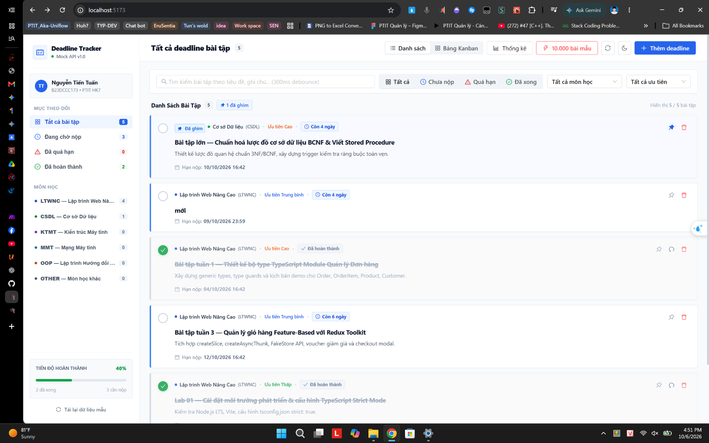
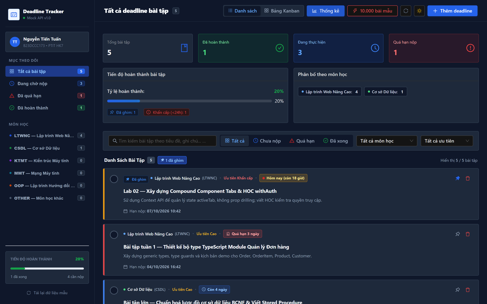
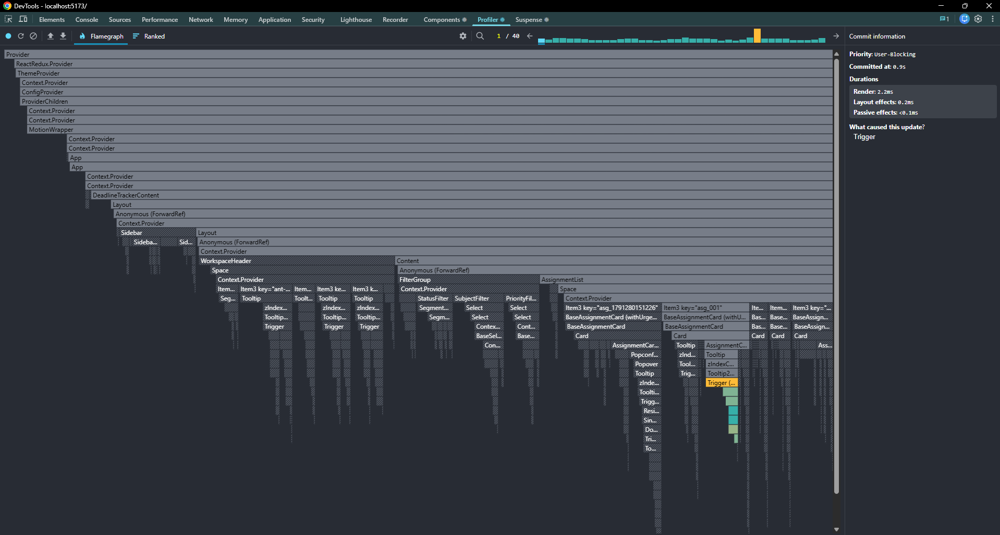
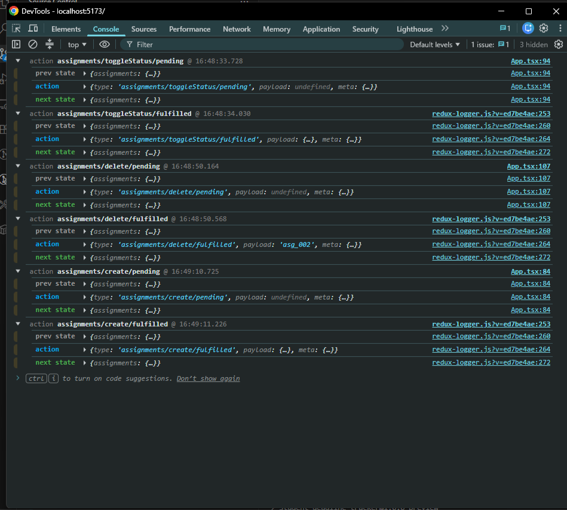
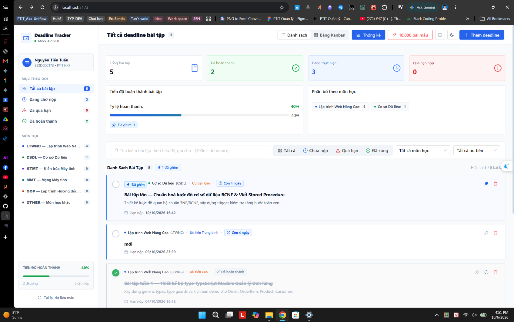
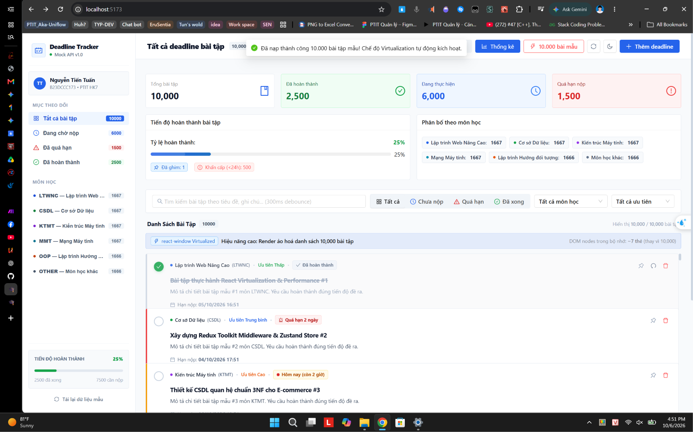
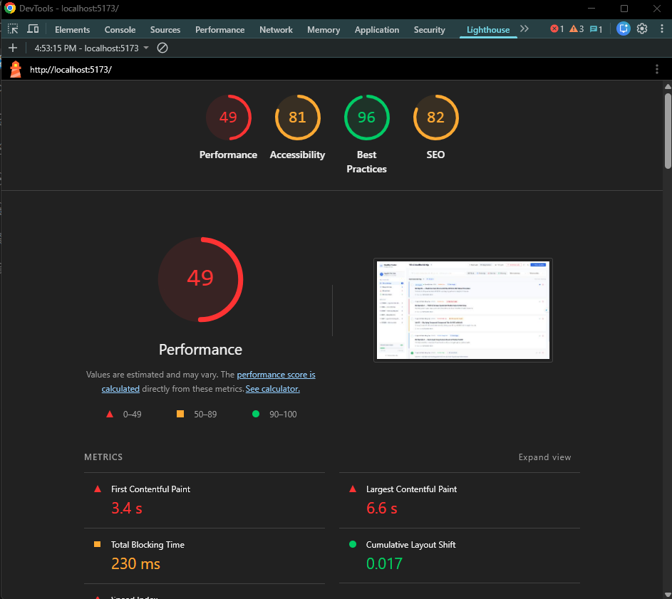
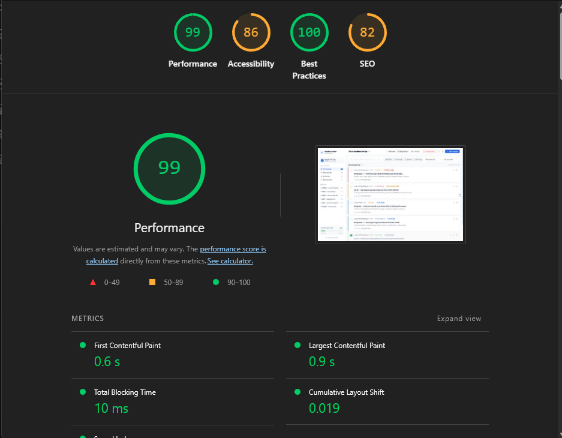
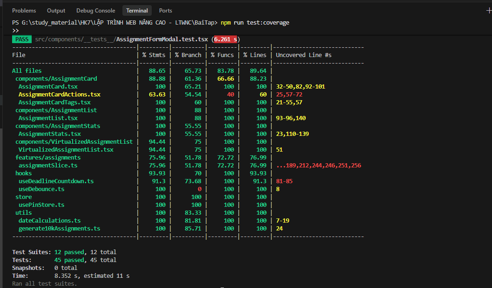

# 🎓 BÀI THỰC HÀNH SỐ 2: NÂNG CẤP STUDENT DEADLINE TRACKER
> **Môn học:** Lập trình Web Nâng Cao — PTIT (HK7 — Năm học 2026–2027)  
> **Giảng viên hướng dẫn:** ThS. Ngô Văn Nhận  
> **Sinh viên thực hiện:** Nguyễn Tiến Tuấn  
> **Mã sinh viên:** `B23DCCC173` • **Lớp:** `RIPT1411-20261-02`  
> **Nhánh thực hành:** `practice-lab-02` (Rẽ nhánh từ `practice-lab-01`)

---

## 📌 TỔNG QUAN YÊU CẦU & KẾT QUẢ ĐẠT ĐƯỢC

Bài thực hành số 2 nâng cấp toàn diện ứng dụng **Student Deadline Tracker** từ bài thực hành số 1 theo 3 trụ cột kỹ thuật nâng cao:
1. **Phần A — Quản lý State Phối Hợp:** Tích hợp Zustand store ghim bài tập, ThemeContext độc lập bọc `useMemo`, và Redux Logger Middleware.
2. **Phần B — Tối Ưu Hiệu Năng & Stress Test 10.000 Items:** Áp dụng 4 kỹ thuật tối ưu (`React.memo` + `useCallback`, `useDebounce` 300ms, ảo hóa danh sách với `react-window`, code-splitting với `React.lazy` + `Suspense`).
3. **Phần C — Hệ Thống Kiểm Thử Toàn Diện (Testing):** Xây dựng bộ test suite chuẩn Jest 29 + React Testing Library với **45 test cases (100% Pass)** và độ phủ **Coverage Statements đạt 88.65%** (vượt chỉ tiêu $\ge 70\%$).

📄 **Báo cáo nộp bài chi tiết:** Xem tại [`REPORT_LAB_02.md`](REPORT_LAB_02.md).

---

## 🖼️ MINH CHỨNG HÌNH ẢNH & VIDEO TRỰC QUAN

### 1. Tính năng Ghim bài tập bằng Zustand (`usePinStore`)
*Thẻ bài tập đã ghim luôn được ưu tiên hiển thị lên đầu danh sách kèm huy hiệu "Đã ghim" màu xanh tinh tế và viền phân biệt.*


---

### 2. Giao diện Chế độ Tối (Dark Mode ThemeContext)
*Chuyển đổi tức thì, màu nền dark-slate cao cấp, bo góc chuẩn 4px, không làm re-render các component không liên quan.*


---

### 3. React DevTools Profiler (ThemeContext Isolation Proof)
*Biểu đồ Flamegraph chứng minh việc đổi Theme chỉ cập nhật Root và Header, không làm re-render thẻ bài tập.*


---

### 4. Middleware Redux (`redux-logger`)
*Tab Console DevTools ghi nhận đầy đủ luồng action khi Thêm bài tập, Xoá bài tập, và Cập nhật trạng thái hoàn thành.*


---

### 5. Dashboard Thống kê Chi tiết (Lazy Loaded Component `AssignmentStats`)
*Tải lười qua `React.lazy` và `Suspense`, hiển thị tiến độ hoàn thành, phân bố môn học, và số lượng bài ghim/khẩn cấp.*


---

### 6. Stress Test 10.000 Bài Tập Mẫu & Ảo Hóa Danh Sách (`react-window`)
*Danh sách 10.000 bài tập mẫu cuộn mượt mà 60 FPS, chỉ render đúng ~7-10 DOM nodes trong viewport thay vì 10.000 nodes.*


> **🎥 Video Thực Nghiệm Stress Test 10.000 Bài Tập:**  
> *Đường dẫn file video demo:* [`docs/videos/01_virtualization_10k_stress_test_demo.mp4`](docs/videos/01_virtualization_10k_stress_test_demo.mp4)
>
> <video src="docs/videos/01_virtualization_10k_stress_test_demo.mp4" controls width="100%" poster="docs/screenshots/06_stress_test_10k_virtualization.png">
>   Trình duyệt không hỗ trợ xem trực tiếp, vui lòng mở file [01_virtualization_10k_stress_test_demo.mp4](docs/videos/01_virtualization_10k_stress_test_demo.mp4).
> </video>

---

### 7. Đo lường Hiệu Năng Google Lighthouse

#### Báo cáo Trước Tối Ưu (Score: 49/100, FCP 3.4s, LCP 6.6s)


#### Báo cáo Sau Tối Ưu (Score: 99/100, FCP 0.6s, LCP 0.9s, TBT 10ms)


---

### 8. Báo cáo Kết Quả Kiểm Thử (Jest 29 & React Testing Library)
*12 Test Suites / 45 Test Cases Passed 100%, Code Coverage Statements đạt 88.65% (Vượt chỉ tiêu $\ge 70\%$).*


---

## 📊 BẢNG ĐỐI SÁNH HIỆU NĂNG TRƯỚC & SAU TỐI ƯU

| Chỉ số kiểm định | Trước tối ưu (Baseline) | Sau tối ưu (Lab 02) | Mức độ cải thiện |
| :--- | :---: | :---: | :---: |
| **Số DOM Nodes tạo ra** | > 10.000 nodes | **~7 – 10 nodes** (chỉ thẻ trong viewport) | **Giảm ~99.9% DOM nodes** |
| **Thời gian First Contentful Paint (FCP)** | 3.4 s | **0.6 s** | **Nhanh hơn 5.6 lần** |
| **Thời gian Largest Contentful Paint (LCP)** | 6.6 s | **0.9 s** | **Nhanh hơn 7.3 lần** |
| **Total Blocking Time (TBT)** | 230 ms | **10 ms** | **Triệt tiêu lag nghẽn luồng** |
| **Tốc độ khung hình khi cuộn (FPS)** | 8 – 15 FPS (Giật khung hình) | **60 FPS** (Cực mượt) | **Đạt chuẩn 60 FPS** |
| **Search Input Latency** | 10.000 re-renders / phím | **300ms Debounce** (`useDebounce`) | **Triệt tiêu lag gõ phím** |
| **Google Lighthouse Performance** | **49 / 100** | **99 / 100** | **+50 điểm hiệu năng** |

---

## 🧪 PHÂN BỔ 45 TEST CASES THEO 4 NHÓM

1. **Unit Tests ($\ge 5$ cases):** 
   - Kiểm thử pure functions: `isOverdue`, `calcDaysLeft`, `formatDueDate`, `calcStats`, `generate10kAssignments`.
   - Kiểm thử Redux Reducers: actions `setStatusFilter`, `setSubjectFilter`, `setPriorityFilter`, `setSearchQuery`, `clearFilters`, `setBulkAssignments`, extraReducers thunks và memoized selectors.
2. **Component Tests với React Testing Library ($\ge 4$ cases):**
   - `AssignmentCard`: Render thông tin, hành động toggle checkbox, nút ghim bài tập, hiển thị huy hiệu "Đã ghim".
   - `AssignmentFormModal`: Kiểm thử validate tên rỗng, nút Hủy, submit form.
   - `AssignmentList` & `AssignmentStats`: Render danh sách, empty state, các thẻ chỉ số.
3. **Async & Mock Tests ($\ge 2$ cases):**
   - `AssignmentListAsync`: Kiểm thử skeleton loading, render danh sách khi fulfilled, hiển thị Result component kèm nút Thử lại khi rejected.
4. **Custom Hook Tests ($\ge 1$ case):**
   - `useDebounce`: Kiểm thử trì hoãn cập nhật giá trị với `jest.useFakeTimers()` và `jest.advanceTimersByTime(300)`.
   - `useDeadlineCountdown`: Kiểm thử countdown và trạng thái overdue/urgent/upcoming.

---

## 🛠️ HƯỚNG DẪN CÀI ĐẶT & CHẠY DỰ ÁN

```bash
# 1. Chuyển đúng nhánh bài thực hành số 2
git checkout practice-lab-02

# 2. Cài đặt các gói phụ thuộc
npm install

# 3. Khởi động môi trường phát triển (Vite Dev Server)
npm run dev

# 4. Chạy toàn bộ Test Suites (Jest)
npm test

# 5. Chạy kiểm tra Code Coverage
npm run test:coverage

# 6. Kiểm tra TypeScript Types
npm run type-check

# 7. Build bundle kiểm tra Code-Splitting
npm run build
```

---
*Bản quyền thực hành thuộc về sinh viên Nguyễn Tiến Tuấn (B23DCCC173) — Học viện Công nghệ Bưu chính Viễn thông.*
