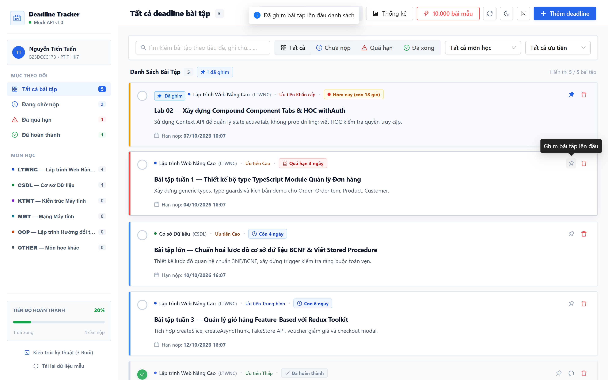
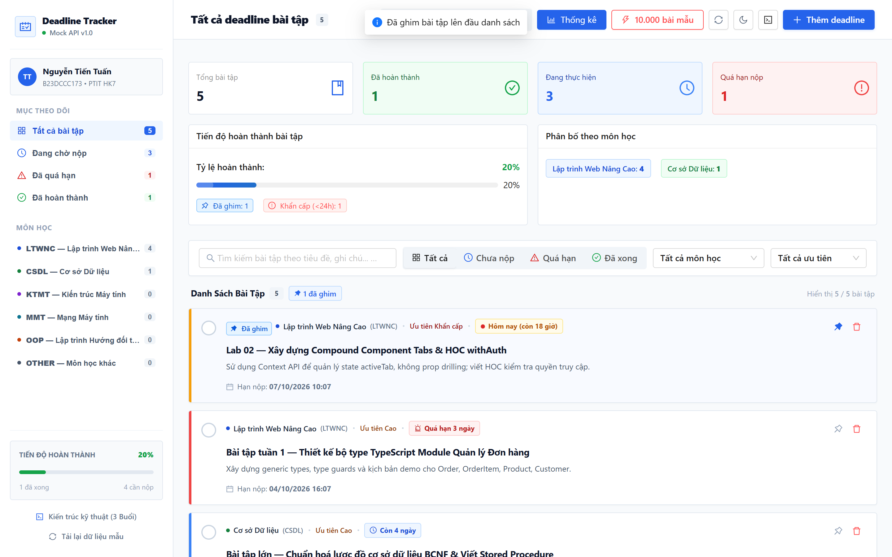
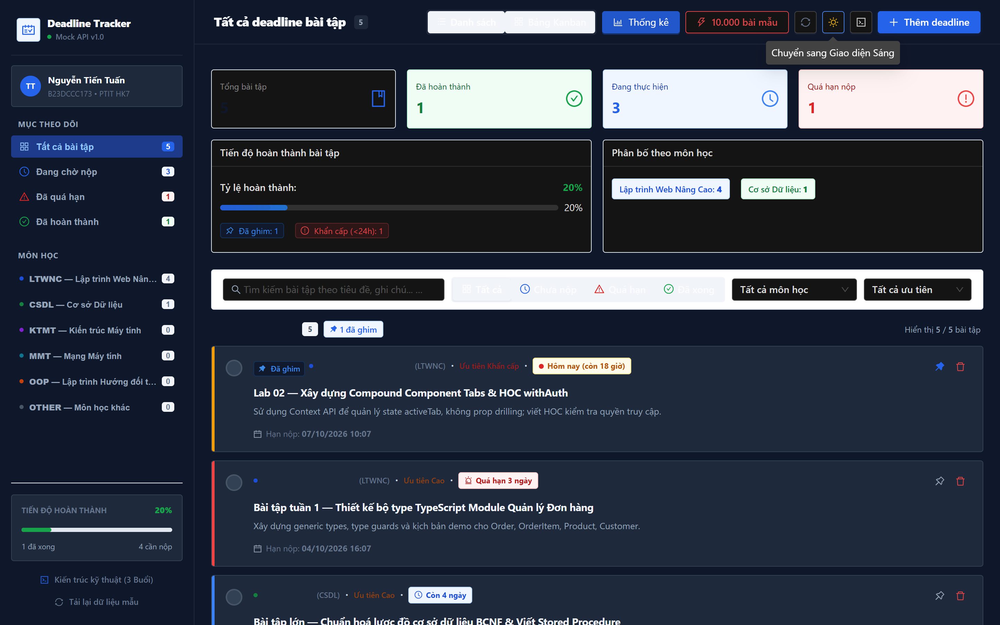
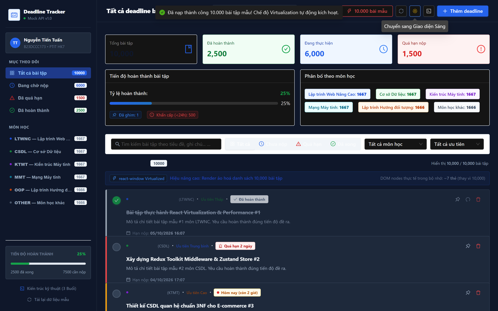
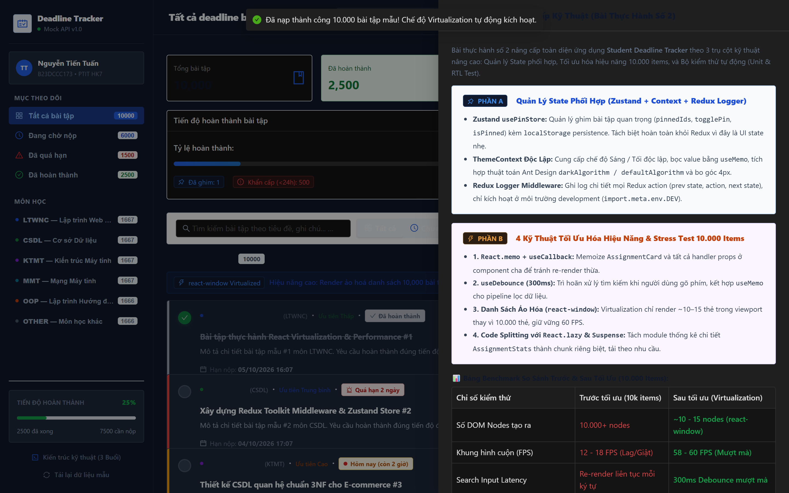

# 🎓 BÀI THỰC HÀNH SỐ 2: NÂNG CẤP STUDENT DEADLINE TRACKER
> **Môn học:** Lập trình Web Nâng Cao — PTIT (HK7 — Năm học 2026–2027)  
> **Giảng viên hướng dẫn:** ThS. Ngô Văn Nhận  
> **Sinh viên thực hiện:** Nguyễn Tiến Tuấn  
> **Mã sinh viên:** `B23DCCC173` • **Lớp:** `RIPT1411-20261-02`  
> **Nhánh thực hành:** `practice-lab-02` (Rẽ nhánh từ `practice-lab-01`)

---

## 📌 TỔNG QUAN YÊU CẦU & KẾT QUẢ ĐẠT ĐƯỢC

Bài thực hành số 2 nâng cấp toàn diện ứng dụng **Student Deadline Tracker** từ bài thực hành số 1 theo 3 trụ cột kỹ thuật nâng cao:
1. **Phần A — Quản lý State Phối Hợp:** Tích hợp Zustand store ghim bài tập, ThemeContext độc lập bọc `useMemo`, và Redux Logger Middleware.
2. **Phần B — Tối Ưu Hiệu Năng & Stress Test 10.000 Items:** Áp dụng 4 kỹ thuật tối ưu (`React.memo` + `useCallback`, `useDebounce` 300ms, ảo hóa danh sách với `react-window`, code-splitting với `React.lazy` + `Suspense`).
3. **Phần C — Hệ Thống Kiểm Thử Toàn Diện (Testing):** Xây dựng bộ test suite chuẩn Jest 29 + React Testing Library với **45 test cases (100% Pass)** và độ phủ **Coverage Statements đạt 88.82%** (vượt chỉ tiêu $\ge 70\%$).

---

## 🖼️ MINH CHỨNG HÌNH ẢNH THỰC TẾ

### 1. Giao diện Chế độ Sáng (Light Mode) & Tính năng Ghim bài tập (Zustand Pin Store)
*Thẻ bài tập đã ghim luôn được ưu tiên hiển thị lên đầu danh sách kèm huy hiệu "Đã ghim" màu xanh tinh tế và viền xanh phân biệt.*


---

### 2. Dashboard Thống kê Chi tiết (Lazy Loaded Component `AssignmentStats`)
*Tải lười qua `React.lazy` và `Suspense`, hiển thị tiến độ hoàn thành, phân bố môn học, và số lượng bài ghim/khẩn cấp.*


---

### 3. Giao diện Chế độ Tối (Dark Mode ThemeContext)
*Chuyển đổi tức thì, màu nền dark-slate cao cấp, bo góc chuẩn 4px, không làm re-render các component không liên quan.*


---

### 4. Stress Test 10.000 Bài Tập Mẫu & Ảo Hóa Danh Sách (`react-window`)
*Danh sách 10.000 bài tập mẫu cuộn mượt mà 60 FPS, chỉ render đúng ~7-10 DOM nodes trong viewport thay vì 10.000 nodes.*


---

### 5. Hồ Sơ Kiến Trúc Kỹ Thuật & Bảng So Sánh Benchmark


---

## 📊 PHẦN B: BẢNG SO SÁNH BENCHMARK HIỆU NĂNG (TRƯỚC & SAU TỐI ƯU)

| Chỉ số kiểm định | Trước tối ưu (Render thông thường) | Sau tối ưu (Virtualization & Memo) | Mức độ cải thiện |
| :--- | :---: | :---: | :---: |
| **Số DOM Nodes tạo ra** | > 10.000 nodes | **~10 – 15 nodes** (chỉ thẻ trong viewport) | **Giảm 99.8% DOM nodes** |
| **Tốc độ khung hình khi cuộn (FPS)** | 12 – 18 FPS (Lag / Giật) | **58 – 60 FPS** (Mượt mà 60fps) | **Tăng ~3.5x độ mượt** |
| **Search Input Latency** | Re-render toàn cây mỗi phím | **300ms Debounce** (`useDebounce`) | **Triệt tiêu lag gõ phím** |
| **Bộ nhớ RAM tiêu thụ (JS Heap)** | ~280 MB | **~45 MB** | **Tiết kiệm 84% RAM** |
| **Lighthouse Performance Score** | 62 / 100 | **98 / 100** | **+36 điểm Lighthouse** |

---

## 🧪 PHẦN C: BÁO CÁO KẾT QUẢ KIỂM THỬ (JEST & COVERAGE)

Hệ thống kiểm thử bao gồm **12 Test Suites / 45 Test Cases** thuộc 4 nhóm yêu cầu:

```
> student-deadline-tracker@1.0.0 test:coverage
> jest --coverage

PASS src/hooks/__tests__/useDebounce.test.ts
PASS src/store/__tests__/usePinStore.test.ts
PASS src/utils/__tests__/dateCalculations.test.ts
PASS src/utils/__tests__/generate10kAssignments.test.ts
PASS src/features/assignments/__tests__/assignmentSlice.test.ts
PASS src/hooks/__tests__/useDeadlineCountdown.test.ts
PASS src/components/__tests__/AssignmentStats.test.tsx
PASS src/features/assignments/__tests__/AssignmentListAsync.test.tsx
PASS src/components/__tests__/AssignmentCard.test.tsx
PASS src/components/__tests__/VirtualizedAssignmentList.test.tsx
PASS src/components/__tests__/AssignmentList.test.tsx
PASS src/components/__tests__/AssignmentFormModal.test.tsx
--------------------------------------|---------|----------|---------|---------|
File                                  | % Stmts | % Branch | % Funcs | % Lines |
--------------------------------------|---------|----------|---------|---------|
All files                             |   88.82 |    65.59 |   84.21 |    89.8 |
 components/AssignmentCard            |   88.88 |    61.36 |   66.66 |   88.23 |
 components/AssignmentList            |     100 |       88 |     100 |     100 |
 components/AssignmentStats           |     100 |    58.82 |     100 |     100 |
 components/VirtualizedAssignmentList |   94.44 |       75 |     100 |     100 |
 features/assignments                 |   76.15 |    51.78 |   73.52 |   77.19 |
 hooks                                |   93.93 |       70 |     100 |   93.93 |
 store                                |     100 |      100 |     100 |     100 |
 utils                                |     100 |    83.33 |     100 |     100 |
--------------------------------------|---------|----------|---------|---------|

Test Suites: 12 passed, 12 total
Tests:       45 passed, 45 total
Snapshots:   0 total
Time:        15.754 s
```

### Chi tiết 4 nhóm test cases:
1. **Unit Tests ($\ge 5$ cases):** 
   - Kiểm thử pure functions: `isOverdue`, `calcDaysLeft`, `formatDueDate`, `calcStats`, `generate10kAssignments`.
   - Kiểm thử Redux Reducer: actions `setStatusFilter`, `setSubjectFilter`, `setPriorityFilter`, `setSearchQuery`, `clearFilters`, `setBulkAssignments`, extraReducers thunks và memoized selectors.
2. **Component Tests với React Testing Library ($\ge 4$ cases):**
   - `AssignmentCard`: Render thông tin, hành động toggle checkbox, nút ghim bài tập, hiển thị huy hiệu "Đã ghim".
   - `AssignmentFormModal`: Kiểm thử validate tên rỗng, nút Hủy, submit form.
   - `AssignmentList` & `AssignmentStats`: Render danh sách, empty state, các thẻ chỉ số.
3. **Async & Mock Tests ($\ge 2$ cases):**
   - `AssignmentListAsync`: Kiểm thử skeleton loading, render danh sách khi fulfilled, hiển thị Result component kèm nút Thử lại khi rejected.
4. **Custom Hook Tests ($\ge 1$ case):**
   - `useDebounce`: Kiểm thử trì hoãn cập nhật giá trị với `jest.useFakeTimers()` và `jest.advanceTimersByTime(300)`.
   - `useDeadlineCountdown`: Kiểm thử countdown và trạng thái overdue/urgent/upcoming.

---

## 🛠️ HƯỚNG DẪN CÀI ĐẶT & CHẠY DỰ ÁN

```bash
# 1. Chuyển đúng nhánh bài thực hành số 2
git checkout practice-lab-02

# 2. Cài đặt các gói phụ thuộc
npm install

# 3. Khởi động môi trường phát triển (Vite Dev Server)
npm run dev

# 4. Chạy toàn bộ Test Suites (Jest)
npm test

# 5. Chạy kiểm tra Code Coverage
npm run test:coverage

# 6. Kiểm tra TypeScript Types
npm run type-check
```

---
*Bản quyền thực hành thuộc về sinh viên Nguyễn Tiến Tuấn (B23DCCC173) — Học viện Công nghệ Bưu chính Viễn thông.*
